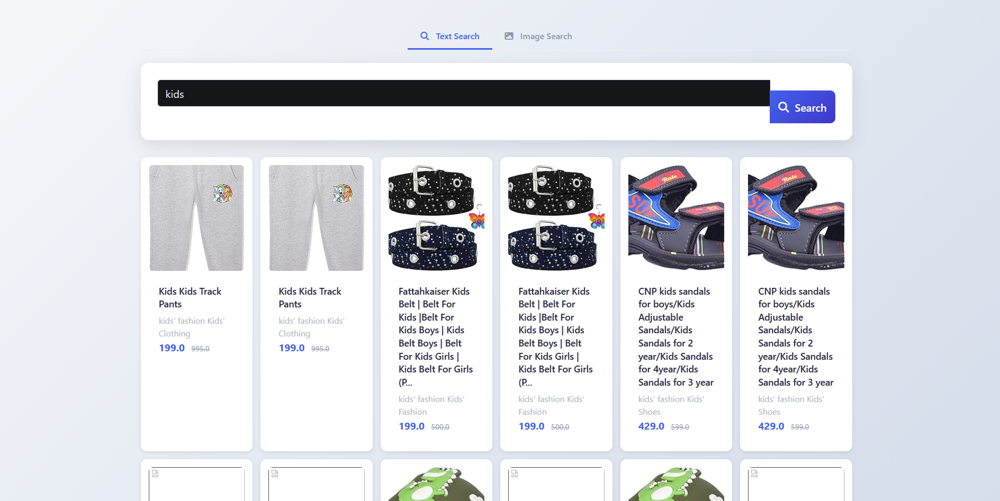
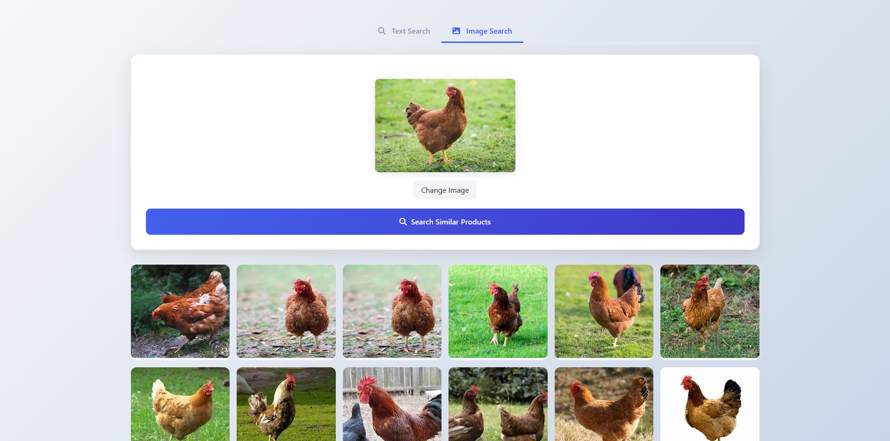

##Проект делается в целях обучения, пробую в нем работать с elasticsearch.

## Демонстрация
### поиск по тексту

### поиск по изображению

пока поиск делается только силами elastic но я хочу дойти до анализа действий пользователей нейронкой что-бы улучшить точность ранжирование.

товары: https://www.kaggle.com/datasets/lokeshparab/amazon-products-dataset
картинки: https://www.kaggle.com/datasets/alessiocorrado99/animals10
